<!--
  This file is generated. Edit profile.config.json (or scripts/) and run
  `npm run build`. Hand edits here are overwritten by the nightly workflow.
  See SETUP.md to use this as a template for your own profile.
-->

 

 

 

**▶ PLAY** &nbsp;&nbsp; [`schichtplaner`](https://github.com/lennystepn-hue/schichtplaner) · [`openclippy`](https://github.com/lennystepn-hue/openclippy) · [`butlr-openclaw-platform`](https://github.com/lennystepn-hue/butlr-openclaw-platform) · [`clawshield`](https://github.com/lennystepn-hue/clawshield) · [`agentcheck`](https://github.com/lennystepn-hue/agentcheck) · [`lenny-pet`](https://github.com/lennystepn-hue/lenny-pet)

All 22 public repositories → [github.com/lennystepn-hue?tab=repositories](https://github.com/lennystepn-hue?tab=repositories)

 

 

---

### ▸ About

I build infrastructure for autonomous AI agents, and small products that get from idea to production fast. 22 public repositories in my first year on GitHub, most of them running somewhere real rather than sitting in a drawer.

The work falls into two piles.

**Agent infrastructure** — making it practical, and safe, to actually run AI agents. [`clawshield`](https://github.com/lennystepn-hue/clawshield) is a security layer for them: one binary, zero config, 50+ checks. [`vibecell`](https://github.com/lennystepn-hue/vibecell) keeps the state of everything you are shipping in one place and wires it straight into Claude Code over MCP. [`butlr-openclaw-platform`](https://github.com/lennystepn-hue/butlr-openclaw-platform) turns OpenClaw into a managed service, with dedicated VMs and billing attached.

**Products with a job to do** — [`schichtplaner`](https://github.com/lennystepn-hue/schichtplaner) is open-source shift planning with real-time collaboration and self-hosting. [`agentcheck`](https://github.com/lennystepn-hue/agentcheck) tells you whether ChatGPT, Claude and Perplexity can find your website at all. [`MenuMagic`](https://github.com/lennystepn-hue/MenuMagic) turns a photo of a restaurant menu into print-ready, allergen-compliant, multilingual designs.

Mostly TypeScript, Python and Vue. German, based in Portugal, working in English and German.

### ▸ Currently

Building agent tooling in the open, and taking on selected freelance work through [lenny.services](https://lenny.services). If any of this is useful to you, issues and pull requests are genuinely welcome — most of these repositories are one contributor away from being a good deal better.

 

 

  Every number above is real, and re-rendered from the GitHub API each night by a
  workflow in this repository. The artwork is drawn pixel by pixel from a hand-built
  5×7 font, with no image editor involved.
   
  <a href="HOW-IT-WORKS.md">How it works</a> · <a href="https://github.com/lennystepn-hue/attract-mode">Use this for your own profile</a>

